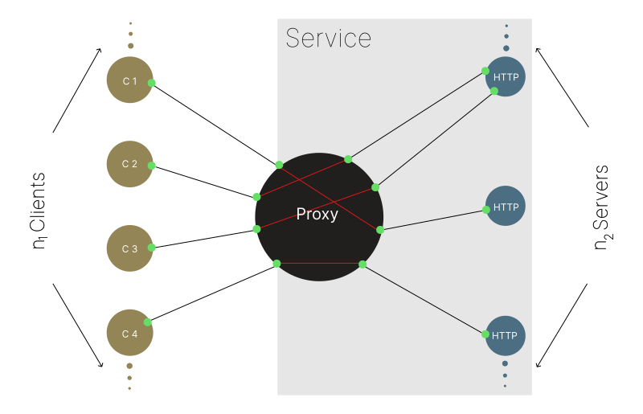
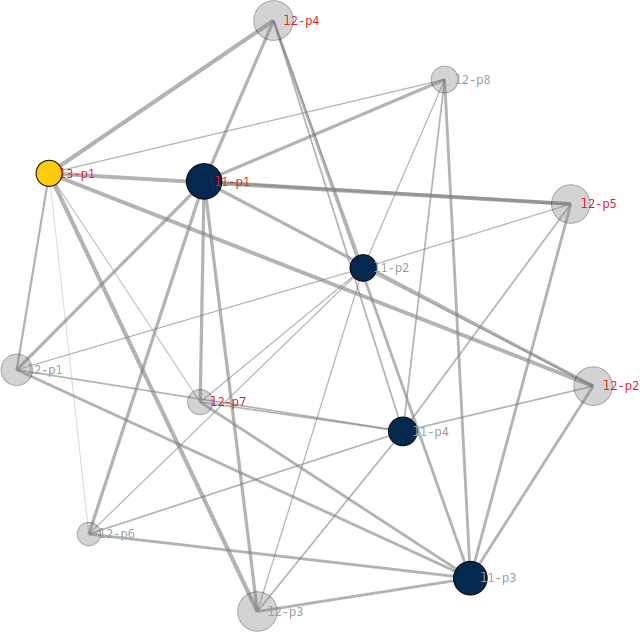

# Introduction

I am a data architect and full stack engineer with an interest in machine learning. My formal education includes a [Master's degree](https://www.si.umich.edu/programs/master-applied-data-science) in applied data science.

My personal GitHub repositories are pushed to the [FAR Analytics & Research](https://github.com/faranalytics) GitHub organization. Examples of my work can also be found in the repositories of the [Educational Technology Collective](https://github.com/educational-technology-collective).

My University of Michigan enterprise GitHub account is located [here](https://github.com/adpatter).

Please see my [resume](https://github.com/adamjpatterson/adamjpatterson/blob/main/Adam_Patterson_Resume.pdf) for more information on my professional background.

## Featured Projects

### [_Network⬄Services_](https://github.com/faranalytics/network-services) <sup><sup>\</TypeScript\></sup></sup> <sup><sup>\</Node.js\></sup></sup>

_Network⬄Services_ provides a simple and intuitive toolkit that makes scaling your app and connecting it to the network _easy_. You can use it to transform an arbitrary application into a network-connected scalable [Service Application](https://github.com/faranalytics/network-services#service-app). You can connect to your Service App, from the same process or another process, and call methods on it using a type-safe [Service API](https://github.com/faranalytics/network-services#service-api).

### [Socketnaut](https://github.com/faranalytics/socketnaut) <sup><sup>\</TypeScript\></sup></sup> <sup><sup>\</Node.js\></sup></sup>

Socketnaut makes scaling native Node.js servers _easy_. A Socketnaut [Service](https://github.com/faranalytics/socketnaut?#concepts) consists of a TCP proxy and a pool of HTTP servers. Socketnaut will uniformly distribute incoming TCP sockets across the pool of allocated servers. This strategy allows for both distribution and parallel processing of incoming requests. Socketnaut consumes native Node.js servers (e.g., `http.Server`, `https.Server`, `net.Server`, `tls.Server`); hence, if you know the [Node API](https://nodejs.org/docs/latest-v18.x/api/http.html), you already know how to build applications on Socketnaut.

Socketnaut can be combined with performant Node.js web application frameworks (e.g.,[ Fastify](https://fastify.dev/), [Koa](https://koajs.com/), [Express](https://expressjs.com/)) in order to easily scale the main module of the web application.

A single Socketnaut instance can handle thousands of _concurrent_ connections when running on capable hardware. When under load, Socketnaut will spawn HTTP servers in order to meet demand and release resources as demand declines; hence, Socketnaut mitigates its memory footprint by effectively managing its thread pool.

### [_Streams_ Logger](https://github.com/faranalytics/streams-logger) <sup><sup>\</TypeScript\></sup></sup> <sup><sup>\</Node.js\></sup></sup>

_Streams_ is an intuitive and performant type-safe logger built on native Node.js streams. You can use the built-in logging components (e.g., the Logger, Formatter, Filter, ConsoleHandler, RotatingFileHandler, and SocketHandler) for common logging tasks or implement your own logging [Node](https://github.com/faranalytics/streams-logger?tab=readme-ov-file#node) to handle a wide range of logging scenarios. Streams offers a graph-like API pattern for building sophisticated logging pipelines.

### [Memoiz](https://github.com/faranalytics/memoiz) <sup><sup>\</Python\>

Memoiz provides a function decorator that can be used in order to augment functions or methods with memoization capabilties. It makes reasonable assumptions about how and if to cache the return value of a function or method based on the arguments passed to it. The decorator can be used on both free and bound functions.

### [JupyterLab Telemetry](https://github.com/educational-technology-collective/etc_jupyterlab_telemetry_library) <sup><sup>\</Python\></sup></sup> <sup><sup>\</JavaScript\></sup></sup>

A JupyterLab extension for capturing [JupyterLab](https://jupyter.org/) events - deployed to the [Coursera](https://www.coursera.org/) learning environment.

### [Port Agent](https://github.com/faranalytics/port_agent) <sup><sup>\</TypeScript\></sup></sup> <sup><sup>\</Node.js\></sup></sup>

Port Agent provides a simple and intuitive interface that makes inter-thread function calls _easy_. Port Agent will marshal the return value or `Error` from the other thread back to the caller. The other thread may be the main thread or a worker thread.

### [_Scalability_](https://github.com/faranalytics/scalability) <sup><sup>\</TypeScript\></sup></sup> <sup><sup>\</Node.js\></sup></sup>

_Scalability_ is a type-safe service scaling facility built on [_Network⬄Services_](https://github.com/faranalytics/network-services). It provides a simple and intuitive API for scaling Node.js modules using Worker threads. You can create a [Service App](https://github.com/faranalytics/network-services#service-app) in your scaled module and call its methods from the main thread using a [Service API](https://github.com/faranalytics/network-services#service-api). _Scalability_ allows you to easily transform your single threaded application into a type-safe multithreaded one.

### [JS HTML Renderer](https://github.com/faranalytics/js-html-renderer) <sup><sup>\</JavaScript\></sup></sup> <sup><sup>\</Node.js\></sup></sup>

A JS DSL for rendering HTML on the client or the server. The JS HTML Renderer provides a concise and intuitive syntax for writing HTML using JavaScript.

### [The Data Science Project](https://github.com/faranalytics/data_science_project) <sup><sup>\</Python\>

The [IMRaD](https://en.wikipedia.org/wiki/IMRAD)-like Python project templates for data science projects.

In the data science domain projects are sometimes shared as an informal assemblage of scripts. This repository proposes two IMRaD-like layouts that can be used for organizing a data science project. The "Informal IMRaD-like Layout" is a Python project organized into materials, methods, and results directories. The "Formal IMRaD-like Flat Layout" is a conventional installable Python flat-layout project that can be built and distributed as a package and published to PyPI.

### [Neural-pleX](https://github.com/faranalytics/neuralplex/) <sup><sup>\</Python\></sup></sup>

Neural-pleX is an object oriented neural network implementation. The Neural-pleX API consists of Network, Layer, and Neuron constructors. The networks can be easily visualized using a visualization library.

## Links

- [Educational Technology Collective](https://edtech.labs.si.umich.edu/)
- [FAR Analytics & Research](https://github.com/faranalytics)
- [LinkedIn](https://www.linkedin.com/in/adamjpatterson/)

## Colophon

```bash
git reset --mixed $(git log --pretty=format:"%h" | tail -n -1) && git status && git add . && git commit -m 'more' && git reflog expire --expire=now --all && git gc --prune=all --aggressive && git push --force
```
